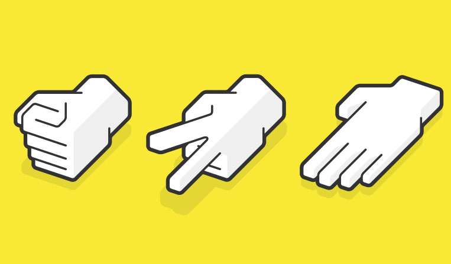

<h1>PIEDRA | PAPEL | TIJERA</h1>

<h2>¿Le ganarás al ordenador con este clásico juego?

A través de una mecánica de manipulación del DOM, se puede interactuar con las imágenes de piera, papel y tijera y que al mismo tiempo, el ordenador a través de la función <em>Math.random()</em> elige su propia tirada y que al realizar una comparativa sabemos si habrás ganado o perdido.

Este juego podrás disfrutarlo tanto en escritorio, como en móvil, ya que su <b>diseño es responsive con tecnología Bootstrap.</b>

Tecnologías adicionales:
<ul>
<li> html 5</li>
<li> CSS 3 </li>
<li> JavaScript</li>
<li> Bootstrap</li>
</ul>

<h5>Tienes un ejemplo de uso de typescript en el <a href="https://github.com/primerocomunico/piedra-papel-tijera/tree/typescript" target="_blank">branch Typescript</a></h5>

Descubre más proyectos en <b><a href="https://primerocomunico.github.io/portfolio/" target="_blank">mi portfolio.</a></b>
<!--  -->
